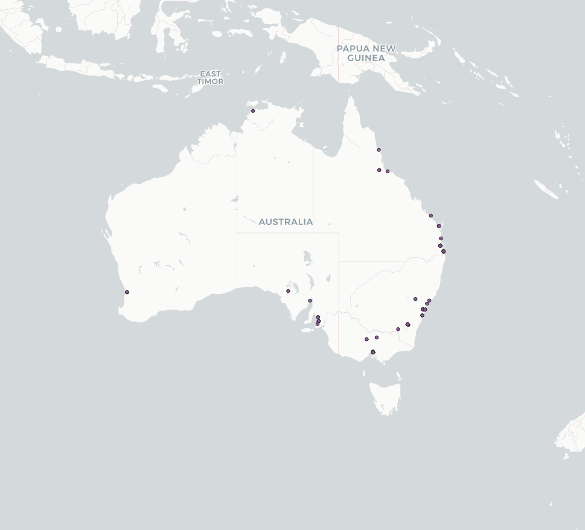
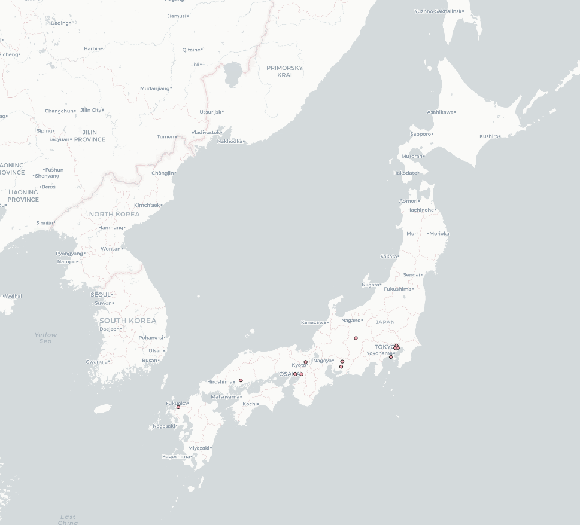
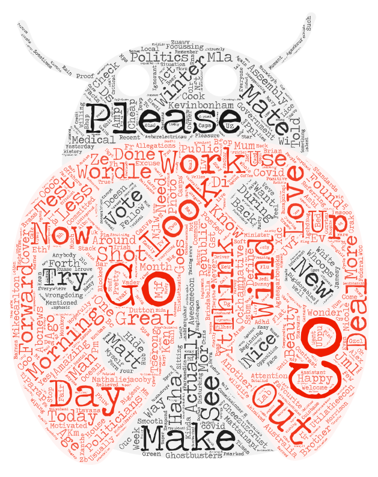
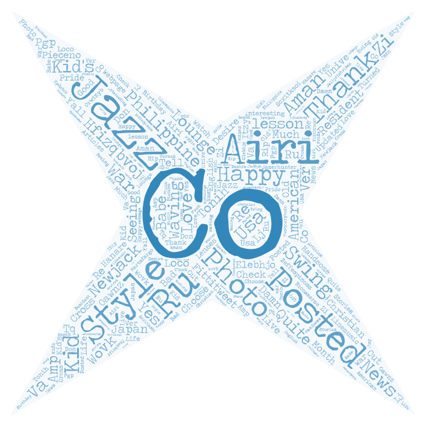

## Tweet Word Clouds

Within this project, I make use of the Twitter v2 API to make maps and wordclouds to visualize the differences of sentiment and spatiality between tweets from two geographies. I compare the island nations of Japan and Australia to see how the tweets vary in content and location.

### Maps

The data mapped is collected for a duration of 10 minutes. These collection times were back to back to ensure that the change in data does not occur due to difference in time of day. Another important thing is that these countries are almost in the same time zone. 

As you can see, the amount of tweets collected in terms of frequency are not comparable. The tweet frequency in Australia within the same interval of time far exceeds that in Japan. This alludes to the fact that Twitter might have a larger user base in Australia. Another interesting feature is that tweets in Australia are concentrated in the coastal regions while tweets in Japan are concentrated randomly, although the majority are still within city centers. 

### Word Clouds

The first word cloud is from Australia and the second one is from Japan. Both word clouds have political words within them. One can argue that one major use of Twitter in both the countries is for political debate or promotion. Australia has words like "Make" and "Create" which means they are talking about creating or making new things. While Japan has words like "Jazz" or "Photo" which means they are more focussed on appreciating arts online.

